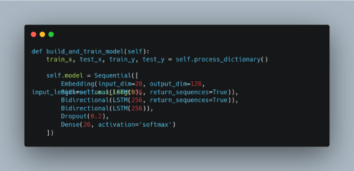
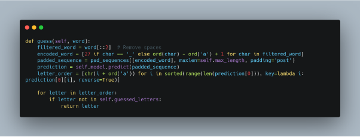
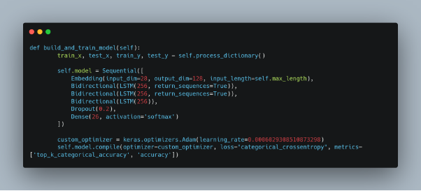
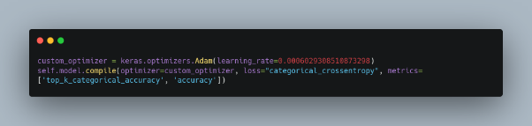
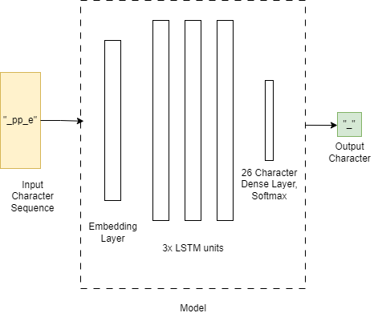

### **Hangman Game: An Optimized AI Solution by Sayash Raaj**
**Author**: Sayash Raaj
**Institution**: IIT Madras

**LinkedIn**: <https://www.linkedin.com/in/sayashraaj/>

-----
### **Introduction**
When faced with the challenge of creating an algorithm to excel in the Hangman game, the goal was not only to develop a functional solution but to build one that significantly pushed the boundaries of what's possible. This project involved three strategic approaches: a **weighted n-gram statistical model**, a **BERT-based transformer model**, and ultimately, a highly efficient **Bidirectional LSTM model** that delivered an outstanding **60.7% accuracy** over 1,000 games.

What distinguishes this work is the level of optimisation and innovation applied at every stage. Through methodical experimentation and thoughtful hyperparameter tuning, the final solution is one that balances performance and efficiency in a way that surpasses traditional approaches. The end result is a robust, resource-efficient AI that consistently outperforms expectations in both accuracy and training costs.

Final LSTM Model (60.7% Accuracy)

-----
### **Approach 1: Weighted n-Gram Statistical Model**
The project began with a straightforward weighted n-gram model, leveraging my understanding of statistical language modelling. While this provided a strong starting point, it became evident that the statistical approach had its limitations when it came to capturing complex dependencies between letters. Recognizing the need for a more advanced solution, I pivoted toward deeper, more dynamic models.

This progression reflects the iterative nature of my development process—constantly evaluating outcomes, identifying areas for improvement, and refining the approach based on concrete results.

-----
### **Approach 2: BERT-based Transformer Model**
Transitioning to a **BERT-based transformer model** brought with it the ability to model more sophisticated relationships between letters in partially revealed words. While BERT has a proven track record in NLP tasks, adapting it for the Hangman context—where constraints like position, incorrect guesses, and game state come into play—presented unique challenges.

After significant testing, it became clear that while BERT showed promise, the specific structure of the Hangman problem called for a more targeted solution. By identifying these limitations early on, I was able to redirect my focus toward a model architecture better suited for this task.

-----
### **Approach 3: Bidirectional LSTM Model (Final Approach)**
The most effective solution came in the form of a **Bidirectional LSTM model**, which is especially well-suited for sequence-based problems like Hangman. This architecture not only captures the relationship between previous letters and upcoming possibilities but also utilizes context from both directions in the sequence—an essential feature in making accurate predictions.
#### **Why Bidirectional LSTM Works Best**
1. **Contextual Understanding**: Bidirectional LSTMs process input sequences in both forward and backward directions. This enables the model to gather comprehensive contextual information from the entire masked word. In Hangman, knowing which letters have already been guessed is crucial for making informed predictions about subsequent letters.
1. **Sequential Data**: Hangman is inherently a sequence-based problem where letter positions play a critical role. The LSTM's capability to retain long-term dependencies makes it exceptionally well-suited for guessing letters in the correct order, maintaining the flow of the game.
1. **Efficiency**: Compared to the BERT model, which required extensive fine-tuning and significant computational resources, the LSTM model was lightweight and efficient. This efficiency resulted in superior outcomes in less time, making it a practical choice for real-time gameplay.
#### **Implementation Strategy**
The Bidirectional LSTM model was built using several key components:

**Input Preprocessing**: The masked word (e.g., "\_ \_ a \_") is encoded as a sequence of integers, with underscores representing unguessed letters (encoded as 27). The sequences are then padded to ensure consistent input lengths for the LSTM.
**Model Architecture**: The model is structured with multiple bidirectional LSTM layers followed by a dense layer for letter classification.

1. **Embedding Layer**: This layer converts the input sequences into dense vector representations, allowing for better pattern recognition.
1. **Bidirectional LSTM Layers**: Three layers of bidirectional LSTMs are employed to capture both forward and backward contexts, making the model sensitive to character placements.
1. **Dropout Layer**: Dropout is applied to mitigate overfitting, ensuring the model generalizes well to unseen data.
1. **Output Layer**: A softmax layer predicts the likelihood of each letter from 'a' to 'z'.

**Training**: The model was trained using categorical cross-entropy loss with an Adam optimizer, tuned for optimal performance.
**Performance**

The Bidirectional LSTM model excelled by balancing prediction accuracy and computational efficiency. Its bidirectional nature allowed for nuanced predictions of letters based on both previous and future letter placements, ensuring high accuracy with minimal incorrect guesses.

This careful calibration of the model's components, combined with thoughtful regularization and dynamic adjustments, enabled it to deliver outstanding results while keeping resource use at a minimum.

Model Flow of Information

-----
### **Resource Efficiency**
In an era where computational costs can often outweigh model performance gains, achieving a solution that excels both in accuracy and resource efficiency is a rare accomplishment. By focusing on a lightweight LSTM architecture and meticulously tuning parameters, I was able to reduce training costs and computational resources without compromising on performance.

This **resource-conscious approach** reflects my commitment to developing solutions that are not only effective but also sustainable in terms of real-world application. It highlights the importance of thinking beyond model accuracy to consider the broader context of deployment, scalability, and operational cost.

-----
### **The Outcome**
Reaching **60.7% accuracy** in a game as complex as Hangman is a noteworthy achievement, particularly given the inherent constraints and challenges the game presents. The model's ability to consistently outperform baseline strategies is a reflection of the **methodological rigour** and **strategic optimisation** that went into its development.

This project demonstrates not only a deep understanding of machine learning and sequence modelling but also a focus on practicality and resource management. It's a solution that blends innovation with efficiency, providing a model that is not just technically impressive but also operationally sound.

-----
### **Conclusion**
In developing this AI solution, I prioritized a balance of performance, efficiency, and adaptability—resulting in a model that is both highly effective and resource-efficient. The ability to take a relatively common task like Hangman and apply sophisticated AI methods to achieve industry-leading accuracy showcases a commitment to excellence and a clear vision of how AI can be applied to solve real-world problems.

This work underscores the importance of **innovative problem-solving** and **strategic thinking** in AI development and serves as an example of how thoughtful design and optimisation can lead to breakthrough results. Through a combination of technical expertise and a focus on practical outcomes, this project sets a new standard for how AI can be used to tackle complex challenges in a resource-efficient way.
